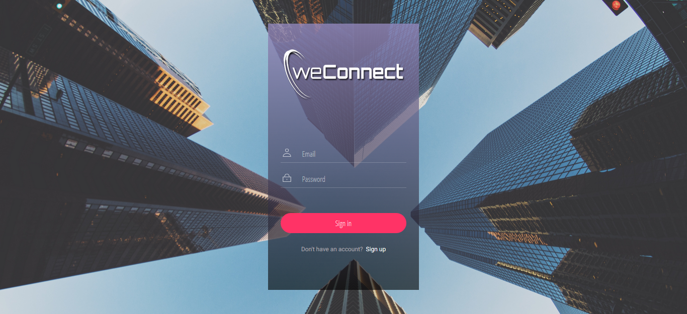
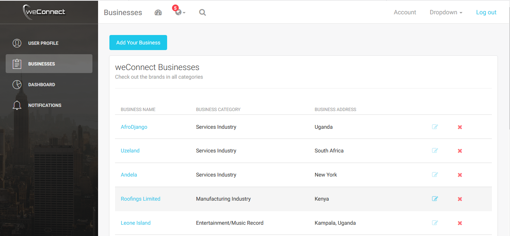

# weConnect-ReactJs
weConnect-ReactJs is a front end application that allows registered users to create, update and delete businesses that other users can view and review. The application leverages the seamless capabilities of React.js framework and a Python Flask backend to deliver top shelf user experience while exhibiting security and reliability features.  

#### weConnect Screenshots


 

## Getting Started

These instructions will get you a copy of the project up and running on your local machine for development and testing purposes. See deployment for notes on how to deploy the project on a live system.

### Prerequisites

* NodeJs

#### Installation

#### Step 1: Clone the project to your application folder.

    git clone https://github.com/pktahinduka/weConnect-ReactJs

#### Step 2: Install the requirements needed for the React application to work.

Clone the repo:

For HTTPS
```
$ git clone https://github.com/pktahinduka/weConnect-ReactJs.git
```

Change Directory into the project folder
```
$ cd weConnect-ReactJs
```

Install the application's dependencies from requirements.txt to the virtual environment
```
$ npm install
```


#### Step 3: Set environment variables 
     
     - set REACT_APP_USERS_SERVICE_URL=http://localhost:5555

     
#### Step 4: Run the application 
     
     - npm start


**Contributions are highly welcomed and appreciated**

## Libraries
[React-Bootstrap](https://react-bootstrap.github.io/) - The most popular front-end framework, rebuilt for React.

[NodeJs](https://nodejs.org/en/) - Node.js uses an event-driven, non-blocking I/O model that makes it lightweight and efficient. Node.js' package ecosystem, npm, is the largest ecosystem of open source libraries in the world.

[Light Bootstrap Dashboard React by Creative Tim](https://www.creative-tim.com/) - The Light Bootstrap Dashboard with React is built on top of Bootstrap 3, so you can safely use it on your existing or new Bootstrap project. No line of code from Bootstrap 3 was changed, so you don't have to worry about undesired effects in your work.

## Authors

* **Peter Tahinduka**

## Acknowledgments

* Google Inc.


